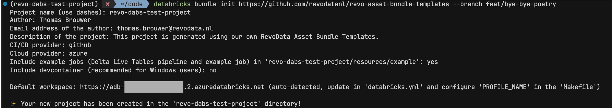

# RevoData Asset Bundle Templates


[](https://www.python.org)
[](https://github.com/astral-sh/uv)
[](https://github.com/astral-sh/ruff)
[](http://mypy-lang.org/)
[](https://github.com/pre-commit/pre-commit)
[](https://github.com/semantic-release/semantic-release)

[](https://github.com/revodatanl/revo-asset-bundle-templates/actions/workflows/ci-dabs.yml)
[](https://github.com/revodatanl/revo-asset-bundle-templates/actions/workflows/semantic-release.yml)

The `RevoData Asset Bundle Templates` repo contains our own custom templates for Databricks Asset Bundles. The template provides a complete development environment for new Databricks projects, including CI/CD pipelines, pre-commit hooks, semantic release, and example pipelines and jobs that can directly be deployed to Databricks.

## Why This Template?

This template solves common pain points in Databricks project setup:

- **Streamlined Setup**: One command creates a fully configured development environment
- **Modern Python Tooling**: Uses `uv` for fast package management, `ruff` for linting, and `mypy` for type checking (pending `ty` reaching production-ready status)
- **Modular Architecture**: Core template is lightweight with optional modules for specialized needs
- **CI/CD Ready**: Complete pipelines for GitHub Actions and Azure DevOps
- **Development Environment**: DevContainer and WSL support for consistent development across platforms

## Getting started

1. Install the [Databricks CLI](https://docs.databricks.com/en/dev-tools/cli/index.html) by running the following command:

    ```bash
    brew tap databricks/tap
    brew install databricks
    ```

    Make sure to add your [configuration profile](https://docs.databricks.com/en/dev-tools/cli/profiles.html) to the `.databrickscfg` file. You will need the name of your profile to initialize a new project.

2. Initialize a new project using the template:

    ```bash
    databricks bundle init https://github.com/revodatanl/revo-asset-bundle-templates
    ```

    

    When initializing your project, you'll be prompted to answer several questions. These configurations will be used to customize your project:

    | Parameter | Description | Example |
    |-----------|-------------|---------------------|
    | `project_name` | Name of the project (usually the same as the repository name) | `revo-dabs-test-project` |
    | `package_name` | Name of the package. Import functions from the package with `from <package_name> import <function_name>` | `revo_dabs` |
    | `author` | Name of the author | `Thomas Brouwer` |
    | `email` | Email address of the author | `thomas.brouwer@revodata.nl` |
    | `project_description` | Brief description of the project | `This project is generated using our own RevoData Asset Bundle Templates.` |
    | `cicd_provider` | CI/CD provider | `github/azure` |
    | `cloud_provider` | Cloud provider | `azure/aws` |
    | `include_example_jobs` | Whether to include example pipelines and jobs | `yes/no` |

## Developing the Template

Databricks Asset Bundle Templates use `Go` template syntax with conditional logic based on the parameters above.

Key development files:

- `template/__preamble.tmpl` - Controls file inclusion using `{{skip}}` directives
- `databricks_template_schema.json` - Defines template variables and validation
- Files with `.tmpl` extension are rendered with `{{.parameter_name}}` replaced accordingly

Test locally using:

```bash
databricks bundle init https://github.com/revodatanl/revo-asset-bundle-templates --branch <branch_name>
```

Changes are protected by comprehensive CI-DABS pipeline testing all template configurations.
