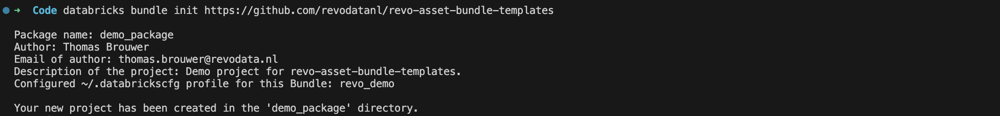

# RevoData Asset Bundle Templates

[](https://www.python.org)
[](https://python-poetry.org/)
[](https://github.com/astral-sh/uv)
[](https://github.com/astral-sh/ruff)
[](http://mypy-lang.org/)
[](https://github.com/pre-commit/pre-commit)
[](https://github.com/semantic-release/semantic-release)

[](https://github.com/revodatanl/revo-asset-bundle-templates/actions/workflows/semantic-release.yml)

The `RevoData Asset Bundle Templates` repo contains our own custom templates for Databricks Asset Bundles. The template provides a complete development environment for new Databricks projects, including GitHub Actions, pre-commit hooks, semantic release, and example pipelines and jobs that can be deployed to Databricks.

Shout out to [Georgel Preput](https://github.com/GeorgelPreput) for providing the foundation for this template!

## Getting started

1. Install the [Databricks CLI](https://docs.databricks.com/dev-tools/cli/databricks-cli) by running the following command:

```bash
brew tap databricks/tap
brew install databricks
```

Make sure to add your [configuration profile](https://docs.databricks.com/en/dev-tools/cli/profiles.html) to the `.databrickscfg` file. You will need the name of your profile to initialize a new project.

2. Initialize a new project using the template:

```bash
databricks bundle init https://github.com/revodatanl/revo-asset-bundle-templates
```

This will create a new directory with the template files. You can now start developing your project.


