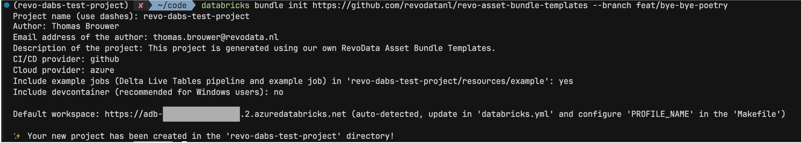

# RevoData Declarative Automation Bundle Templates


[](https://www.python.org)
[](https://github.com/astral-sh/uv)
[](https://github.com/astral-sh/ruff)
[](https://github.com/astral-sh/ty)
[](https://github.com/pre-commit/pre-commit)
[](https://github.com/semantic-release/semantic-release)

[](https://github.com/revodatanl/revo-dabs/actions/workflows/ci-dabs.yml)
[](https://github.com/revodatanl/revo-dabs/actions/workflows/semantic-release.yml)


The `RevoData Declarative Automation Bundle Templates` repo contains our own custom templates for Declarative Automation Bundles (formerly Databricks Asset Bundles). The template provides a complete development environment for new Databricks projects, including CI/CD pipelines, pre-commit hooks, semantic release, and example pipelines and jobs that can directly be deployed to Databricks.

## Why This Template?

This template solves common pain points in Databricks project setup:

- **Streamlined Setup**: One command creates a fully configured development environment
- **Modern Python Tooling**: Uses `uv` for fast package management, `ruff` for linting, and `ty` for type checking
- **Modular Architecture**: Core template is lightweight, with experimental accelerators (work in progress) for specialized needs
- **CI/CD Ready**: Complete pipelines for GitHub Actions and Azure DevOps
- **Development Environment**: DevContainer and WSL support for consistent development across platforms

## Getting started

1. Install the [Databricks CLI](https://docs.databricks.com/en/dev-tools/cli/index.html) by running the following command:

    ```bash
    brew tap databricks/tap
    brew install databricks
    ```

    Make sure to add your [configuration profile](https://docs.databricks.com/en/dev-tools/cli/profiles.html) to the `.databrickscfg` file. You will need the name of your profile to initialize a new project.

2. Initialize a new project using the template:

    ```bash
    databricks bundle init https://github.com/revodatanl/revo-dabs
    ```

    

    When initializing your project, you'll be prompted to answer several questions. These configurations will be used to customize your project:

    | Parameter | Description | Example | Condition |
    | --------- | ----------- | ------- | --------- |
    | `project_name` | Name of the project (usually the same as the repository name) | `revo-dabs-test-project` | |
    | `project_description` | Brief description of the project | `This project is generated using our own RevoData Declarative Automation Bundle Templates.` | |
    | `author` | Name of the author | `Thomas Brouwer` | |
    | `email` | Email address of the author | `thomas.brouwer@revodata.nl` | |
    | `setup_type` | Type of setup (`default`, `minimal` or `tailored`) | `default` | |
    | `include_cicd` | Set up CI/CD pipeines | `yes/no` | `setup_type` = `tailored` |
    | `cicd_provider` | CI/CD provider | `github/azure` | `include_cicd` = `yes` |
    | `cloud_provider` | Cloud provider (skipped if `include_cicd` = `no`) | `azure/aws` | `include_cicd` = `yes` |
    | `include_example_jobs` | Whether to include example pipelines and jobs | `yes/no` | `setup_type` = `tailored` |
    | `support_windows` | Whether to include Windows support | `yes/no` | `setup_type` = `tailored` |
    | `include_dab_recipes` | Whether to include just recipes for Databricks Bundle commands | `yes/no` | `setup_type` = `tailored` |
    | `empower_vscode` | Whether to include VS Code settings, extension recommendations, and just recipes | `yes/no` | `setup_type` = `tailored` |

    > Previously, specifying a `package_name` was required. The `package_name` is now automatically generated from the `project_name` by replacing dashes (`-`) with underscores (`_`) following Python package naming conventions.

    This table contains the values passed for setup types `default` and `minimal`. When `setup_type` is `tailored`, the values are determined by the user's choices.

    | Parameter | Default | Minimal |
    | --------- | ------- | ------- |
    | `include_cicd` | `yes` | `no` |
    | `cicd_provider` | `azure` | `` |
    | `cloud_provider` | `azure` | `` |
    | `include_example_jobs` | `yes` | `no` |
    | `support_windows` | `yes` | `no` |
    | `include_dab_recipes` | `yes` | `no` |
    | `empower_vscode` | `yes` | `no` |

3. Set up a fully configured development environment by running:

    ```bash
    just
    ```

## Developing the Template

Declarative Automation Bundle Templates use `Go` template syntax with conditional logic based on the parameters above.

Key development files:

- `template/__preamble.tmpl` - Controls file inclusion using `{{skip}}` directives
- `databricks_template_schema.json` - Defines template variables and validation
- Files with `.tmpl` extension are rendered with `{{.parameter_name}}` replaced accordingly

Test locally using:

```bash
databricks bundle init https://github.com/revodatanl/revo-dabs --branch <branch_name>
```

Changes are protected by comprehensive CI-DABS pipeline testing all template configurations.
