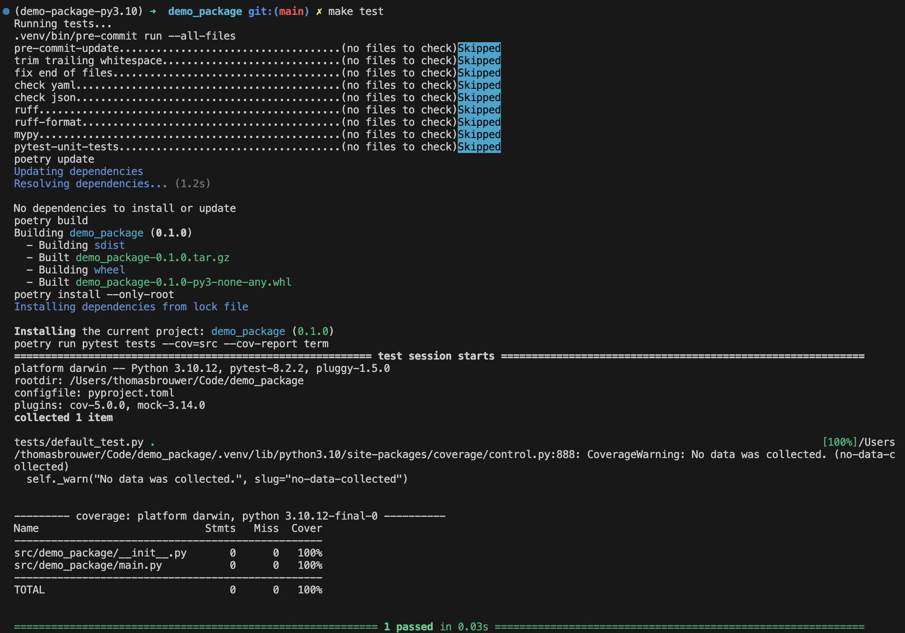

# Development

## Environment Configuration

Outlined below are the configuration settings and tools used to establish a robust and efficient development environment for our project.

#### Python

Our project uses `Python 3.10.12` to match `Databricks Runtime 14.3 LTS`.

#### Poetry for Dependency Management

Our project uses [`Poetry`](https://python-poetry.org/) for managing dependencies, which are specified in the `pyproject.toml` file. This modern tool eliminates the need for a `requirements.txt` file, and provides several advantages over the traditional methods, including:

- **Enhanced Dependency Resolution**: `Poetry` resolves and locks dependencies more effectively, reducing conflicts.
- **Environment Management**: `Poetry` creates and manages virtual environments automatically, ensuring consistency.
- **Project Metadata**: The `pyproject.toml` file includes project metadata, which improves project organization and documentation.

#### Ruff and mypy for Code Formatting and Linting

Our project uses [`Ruff`](https://docs.astral.sh/ruff/) for linting and code formatting, and [`mypy`](https://mypy.readthedocs.io/en/stable/) for static type checking. These tools work in tandem to ensure code quality and consistency, making the codebase more maintainable and readable.

#### Pre-Commit Hooks

We utilize a set of [`pre-commit`](https://pre-commit.com/) hooks defined in the `.pre-commit-config.yaml` file. These hooks run various checks and formatting tools before code is committed, ensuring that only well-formatted and lint-free code is pushed to the repository.

By adhering to these configurations and tools, we ensure a consistent, high-quality, and efficient development process.

#### Visual Studio Code

We recommend to use [`VSCode`](https://code.visualstudio.com/) for development. Default IDE settings are included, ensure a consistent and efficient development experience.

## CI/CD

The project uses GitHub Actions for CI/CD. The pipeline configuration, including a pull request template, is located in the `.github` directory.

Two pipelines are defined in the `.github/workflows` directory:

- `ci.yml`: The CI pipeline runs on every pull request.
- `semantic-pr.yml`: The semantic PR pipeline runs on every pull request and checks for semantic versioning compliance.
- `semantic-release.yml`: The semantic release pipeline runs on every push to the `main` branch and, based upon pull request tags, automatically bumps the version of the package.

#### CI

This `CI` pipeline is triggered upon a pull request to any branch. It runs continuous integration tasks across multiple operating systems, setting up the environment, installing dependencies, running formatting checks with `ruff` and `mypy`, executing unit tests with coverage reporting, and finally building and validating the package to ensure consistency between source and built files.

#### Lint Pull Request Title

This pipeline is triggered when a pull request is opened, edited, or synchronized. It ensures that the pull request title follows Conventional Commits guidelines using the `amannn/action-semantic-pull-request` action.

#### Semantic Release

This pipeline is triggered when a pull request is closed and merged into the main branch. It checks out the code, sets up the environment, and uses `python-semantic-release` to handle versioning and releasing the package. To trigger the automated versioning process, please ensure your commit messages follow semantic versioning conventions. Use prefixes like `fix:`, `feat:`, or `breaking:` (or `feat!:`) in your commit messages to indicate the type of change:

- `fix:` for bug fixes: triggers a patch version update (e.g., 1.0.0 -> 1.0.1)
- `feat:` for new features: triggers a minor version update (e.g., 1.0.0 -> 1.1.0)
- `breaking:` (or `feat!:`) for breaking changes: triggers a major version update (e.g., 1.0.0 -> 2.0.0)

This ensures automated semantic versioning and release management, maintaining consistency and clarity in version updates.

## Tests

This section provides comprehensive information about the testing setup and detailed descriptions of the test modules.

### Running Tests

To run (unit and/or integration) tests locally (including coverage), run the following command:

```bash
poetry run pytest -v tests (--cov=src)
```

For a full test suite, including pre-commit checks, dependency updates, package building, and test coverage reporting, run the following command:

```bash
make test
```



### Writing New Tests

- Tests are located in the `tests` directory
- All tests have a leading `test_` to the function and/or class - following the `pytest` convention

### Coverage

The test coverage is calculated using the `pytest-cov` plugin. The coverage report is generated in the `.coverage` file. A complete test coverage report is available [here](tests/index.md#coverage) after running the `make test` command. We should always aim for a test coverage of at least 80%.

## Documentation

Our project used `mkdocs` to generate comprehensive HTML documentation from markdown files in the `docs` directory. In addition, we use `pdoc3` to auto-generate HTML documentation (from doctrings) of modules and tests. Embedded in the documentation is the coverage report generated by `pytest-cov`.

Lastly, we use `mkdocs-material` to enhance the visual appearance of the documentation.

To generate documentation, run the following command:

```bash
make docs
```
