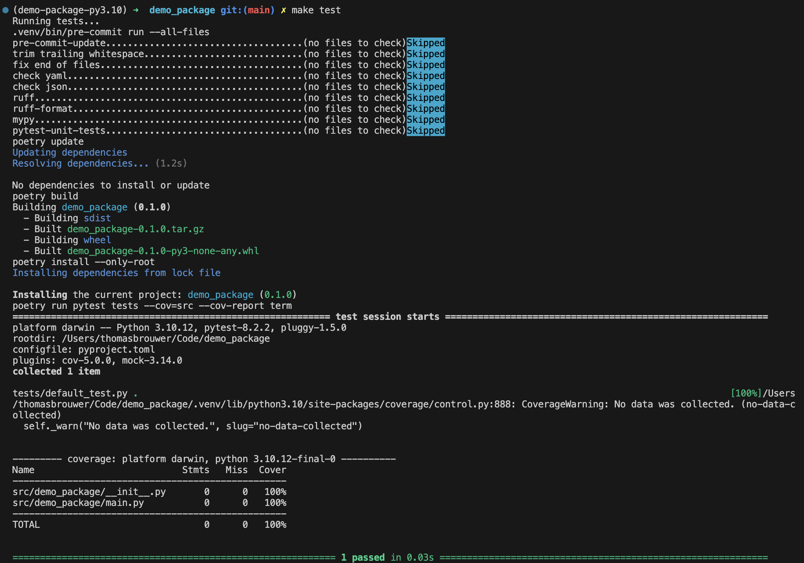

# Testing

## Running Tests

To run the tests locally (including coverage), run the following command:

```bash
poetry run pytest -v tests (--cov=src)
```

For a full test suite, including pre-commit checks, dependency updates, package building, and test coverage reporting, run the following command:

```bash
make test
```



## Writing New Tests

- Tests are located in the `tests` directory
- All tests have a leading `test_` to the function and/or class - following the `pytest` convention

## Test Coverage

The test coverage is calculated using the `pytest-cov` plugin. The coverage report is generated in the `.coverage` file.
