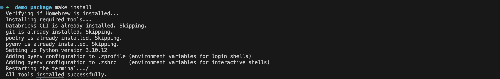
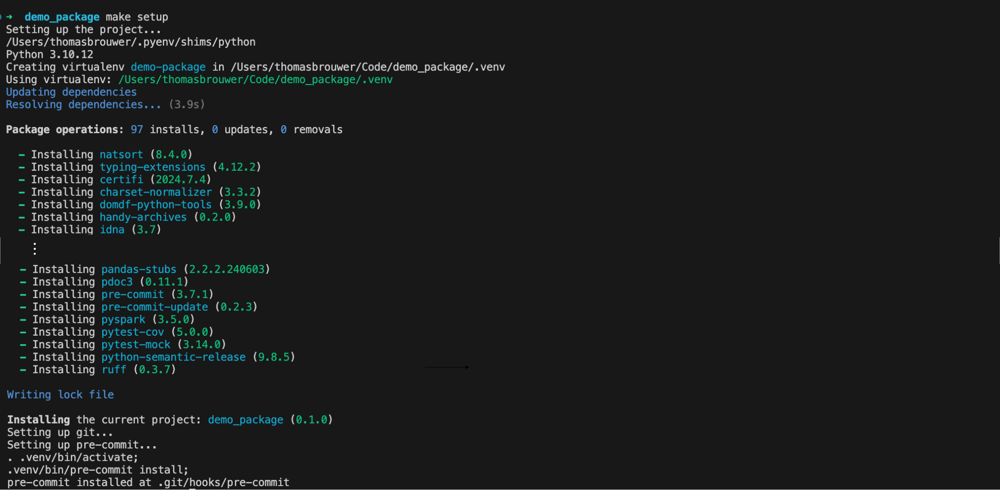
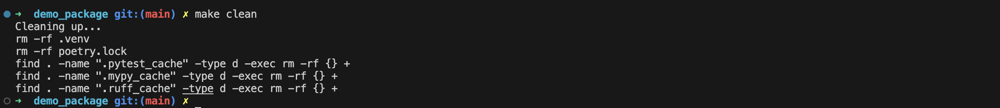

# Setup and Installation

## Prerequisites

This project heavily depends on the provided `Makefile` for various tasks. Without [make](https://www.gnu.org/software/make) installed, you will need to run the commands described in the `Makefile` manually.

Note that on **Windows** most commands need to be adjusted to function properly.

## Installation

To install the prerequisites, run the following command:

```bash
make install
```

This will:

- Install [Homebrew](https://brew.sh) if not already installed.
- Install the required tools: [Databricks CLI](https://docs.databricks.com/dev-tools/cli/databricks-cli.html), [git](https://git-scm.com), [Poetry](https://python-poetry.org/docs) >= 1.6.1, and [pyenv](https://github.com/pyenv/pyenv).
- Set up the Python version specified in the `.python-version` file using pyenv.
- Add pyenv configuration to `.zprofile` and `.zshrc`.



## Set up the development environment

To set up a fully configured development environment for this project, run the following command:

```bash
make setup
```

This will:

- Configure Poetry to create a virtual environments inside the `.venv` folder in the project directory.
- Use the specified Python version to create the virtual environment.
- Install all dependencies.
- Initialize a `git` repository if not already present.
- Install the `pre-commit` hooks.



## Clean up the development environment

To deactivate and remove the virtual environment, remove the `poetry.lock` file, and removes any caches, run the following command:

```bash
make clean
```


