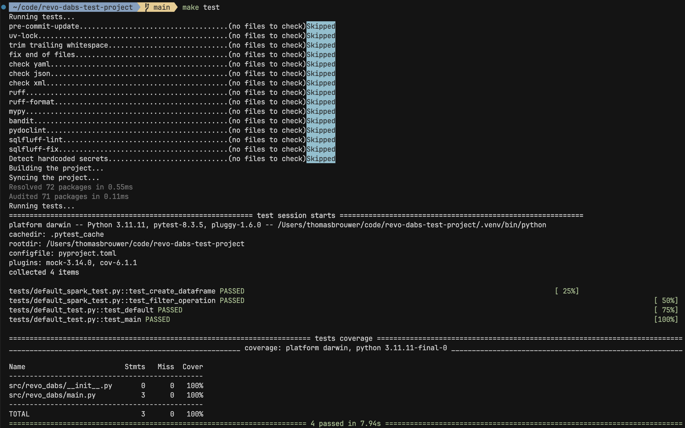
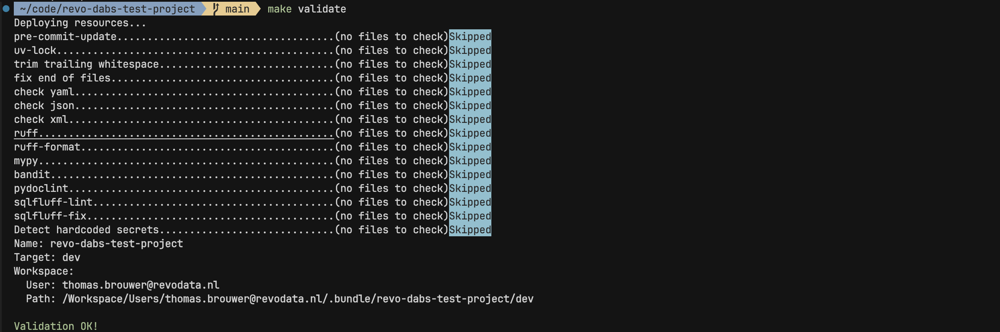
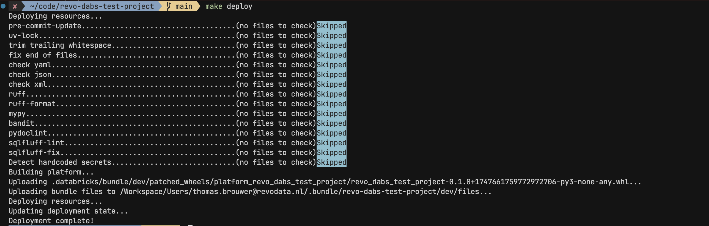
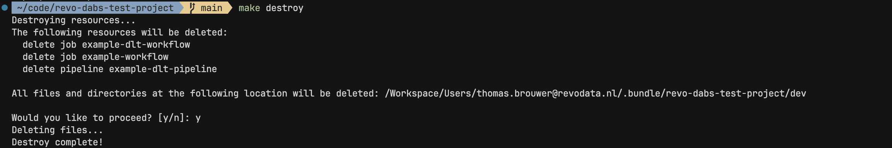
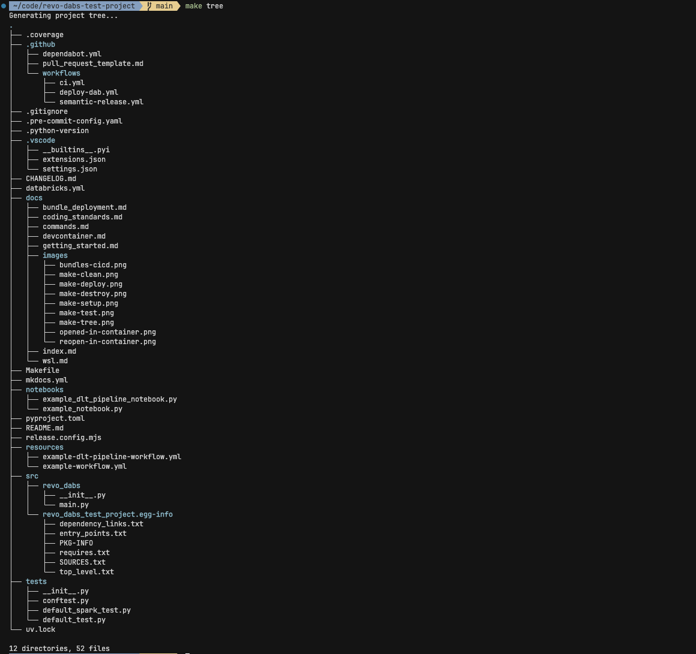
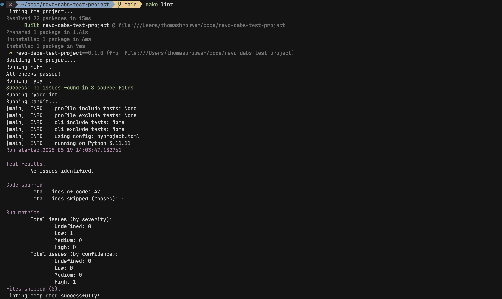

# Command Reference

The project contains a `Makefile` with several commands to simplify common development tasks.

### `make (setup)`

**Sets up the project development environment.**

The command installs [`Git`](https://git-scm.com), [`uv`](https://github.com/astral-sh/uv), and the [Databricks CLI](https://docs.databricks.com/dev-tools/cli/databricks-cli.html), configures Python, sets up a virtual environment, and installs pre-commit hooks. The current project configuration matches Databricks Runtime `15.4-LTS`.

example output

### `make clean`

**Cleans up the project by removing any Python virtual environments, cached files, and artifacts.**

example output

### `make test`

**Runs a full test suite and generates a coverage report using `pytest`.**

Prior to running the test suite, it updates dependencies, builds the package, and runs pre-commit hooks over all files, to mimic functionality during CI.

example output

### `make validate`

**Validates the bundle resources.**

Prior to validation, it updates dependencies, builds the package, and runs pre-commit hooks over all files, to mimic functionality during CI.

example output

### `make deploy`

**Deploys bundle resources to the default Databricks environment.**

Prior to deployment, it updates dependencies, builds the package, and runs pre-commit hooks over all files, to mimic functionality during CI.

example output

### `make destroy`

**Destroys bundle resources deployed to the default Databricks environment.**

example output

### `make tree`

**Generates a tree representation of the project directory structure, excluding irrelevant directories.**

example output

### `make lint`

**Runs linters on the project code: `ruff`, `mypy`, and `pydoclint`.**

example output

