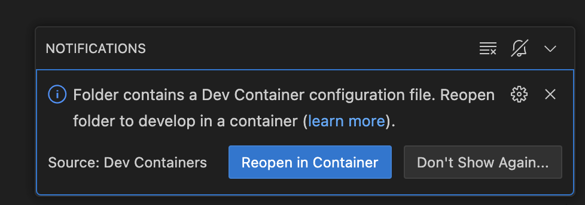
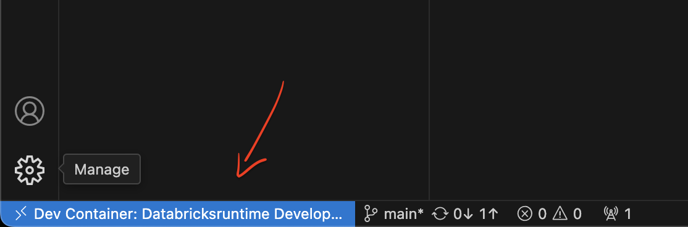

# Setting up a Development Environment with DevContainers

This document explains how to set up a consistent development environment for Databricks Asset Bundles using DevContainers. This approach works on **Windows**, **macOS**, and **Linux** with minimal setup requirements.

This approach sets up Databricks Runtime, Python environment, development tools, VS Code extensions, and configuration to match your production environment.

## Prerequisites

You need these tools installed on your system:

- [VS Code](https://code.visualstudio.com/)
- [Docker Desktop](https://www.docker.com/products/docker-desktop/)
- [VS Code Dev Containers extension](https://marketplace.visualstudio.com/items?itemName=ms-vscode-remote.remote-containers)

## Quick Start

1. **Authenticate your local machine**

   Set up authentication via `SSH` following this guide: [Use SSH keys to authenticate to Azure Repos](https://learn.microsoft.com/en-us/azure/devops/repos/git/use-ssh-keys-to-authenticate?view=azure-devops).

   Open a **PowerShell** terminal and generate keys by running:

   ```bash
   ssh-keygen -t rsa-sha2-256
   ```

   Don't bother to create a passphrase, just press `Enter` to skip it. The keys are now stored in `~/.ssh/`. Display the contents of the public key (`~/.ssh/id_rsa.pub`) by running:

   ```bash
   cat ~/.ssh/id_rsa.pub
   ```

   Copy the key to your **Azure DevOps** account by following the instructions in the guide.

2. **Configure Git**

   To configure Git with your correct name and email run:

   ```bash
   git config --global user.name "Your Name"
   git config --global user.email "your.email@example.com"
   ```

   Replace accordingly. Validate settings by running:

   ```bash
   git config --list
   ```

3. **Configure Databricks Authentication with a Personal Access Token**

   You will need to have the Databricks CLI installed. Run the following commands:

   ```bash
   winget search databricks
   winget install Databricks.DatabricksCLI
   ```

   

   Confirm whether the Databricks CLI is installed correctly by running:

   ```bash
   databricks --version
   ```

   Next, follow the instructions in the [official Databricks documentation](https://docs.databricks.com/aws/en/dev-tools/auth/pat#databricks-personal-access-tokens-for-workspace-users) to create a Personal Access Token (PAT). Once you have the token, update your configuration by running:

   ```bash
   databricks configure
   ```

   This silently creates a `.databrickscfg` file in your home directory to authenticate the user. Note that the profile name is `DEFAULT` in this example. If you give it any other name, you will need to update it in the `Makefile`.


4. **Clone Repo**

   Create a dedicated folder in your root folder and clone your project by running:

   ```bash
   git clone <your-repository-url>
   ```

   There might be a question about the authenticity of the RSA key fingerprint you have just created; just type `yes` to continue.


6. **Build and Start the Dev Container**

   Open VS Code and navigate to the repo folder. Automatically it should pick up the `devcontainer.json` file and prompt you to build and reopen in container.

   When VS Code prompts you to "Reopen in Container" click on it, or:
   - Click the `Notifications` button in the bottom-right corner
   - Select "Reopen in Container"

   

   The first time you do this, VS Code will build the container (this might take a few minutes). Note that `Docker Desktop` is supposed to be running. When the container is running, you will see it in the bottom-left corner of VS Code:

   

## Using the Development Environment

### SSH and Databricks Authentication

The container automatically mounts:

- Your local SSH keys (from `~/.ssh`)
- Your Databricks configuration (from `~/.databrickscfg`)

**Important**: These configurations are **_required_** for the container to start properly. The `entrypoint` script will check for these configurations and exit with errors if they are missing or misconfigured. If the container fails to start, check the error messages which will indicate what configuration is missing.

Once your container is configured and running, you can:

- Interact with Azure Repos using `git` commands
- Run (`PySpark`) tests using the `make test` command
- Deploy to Databricks using the `make deploy` command
- Destroy Databricks resources using the `make destroy` command

## Troubleshooting

If you encounter issues:

1. Make sure Docker Desktop is running
2. Check that your SSH keys are properly configured
3. Verify your Databricks configuration is present in `~/.databrickscfg`
4. Try rebuilding the container (without cache) if you experience dependency issues
