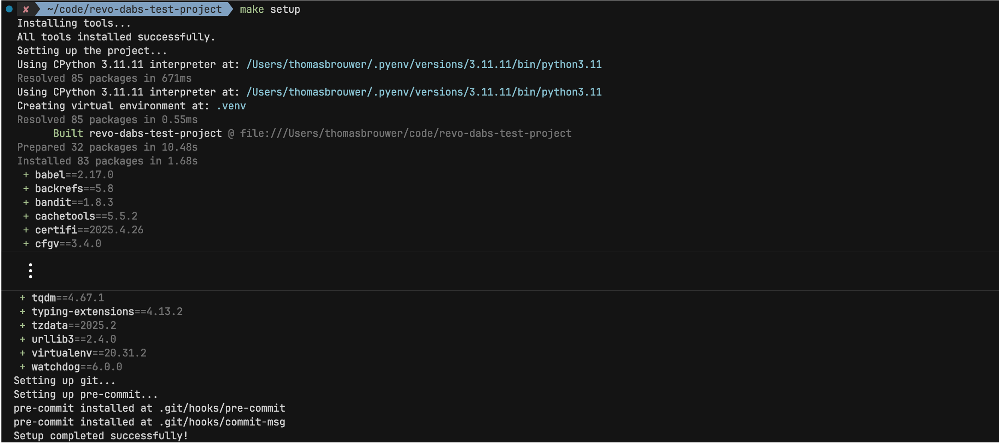

# Getting Started

## Prerequisites

This project heavily depends on the provided `Makefile` for various tasks. Without [`make`](https://www.gnu.org/software/make) installed, you will need to run the commands described in the `Makefile` manually.

Additional prerequisites include:

- [`Git`](https://git-scm.com)
- [`uv`](https://github.com/astral-sh/uv)
- [`Databricks CLI`](https://docs.databricks.com/dev-tools/cli/databricks-cli.html)

The project is natively built for **Linux** or **macOS**. For **Windows** users we suggest developing in a **DevContainer** or setting up a **[Windows Subsystem for Linux (WSL)](wsl.md)** environment (recommended).

## Quick Setup

Set up a fully configured development environment by running:

```bash
make (setup)
```

This will:

- Creating a virtual environment in the `.venv` with the Python version specified in the `.python-version` file
- Initializing a `git` repository if not already present
- Installing, updating and running the `pre-commit` hooks


