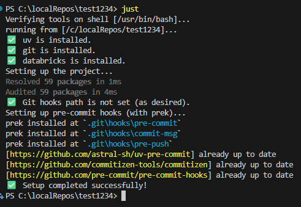

# Getting Started

## Prerequisites

This project heavily depends on the provided `.justfile` for various tasks. Without [`just`](https://just.systems/man/en/packages.html) installed, you will need to run the commands described in the `.justfile` manually.

Additional prerequisites include:

- [`Git`](https://git-scm.com)
- [`uv`](https://github.com/astral-sh/uv)
- [`Databricks CLI`](https://docs.databricks.com/dev-tools/cli/databricks-cli.html)

The project is natively built for **Linux**, **macOS** and **Windows**.

## Quick Setup

Set up a fully configured development environment by running:

```bash
just
```

This will:

- Create a virtual environment in the `.venv` with the Python version specified in the `.python-version` file
- Initialize a `git` repository if not already present
- Install, update and run the `pre-commit` hooks


