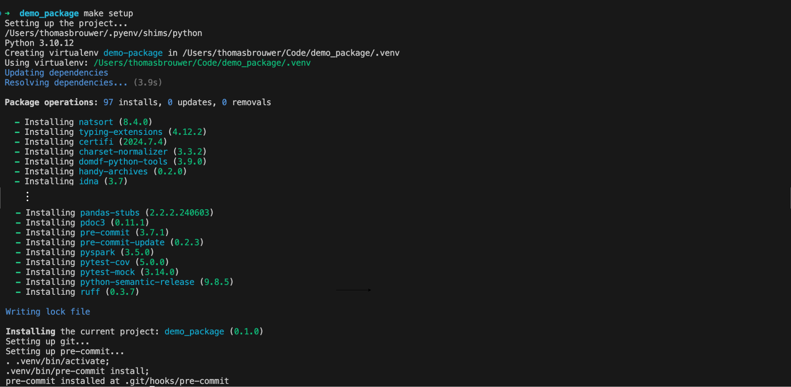

# Getting Started

## Prerequisites

This project heavily depends on the provided `Makefile` for various tasks. Without [`make`](https://www.gnu.org/software/make) installed, you will need to run the commands described in the `Makefile` manually.

### Installation on Windows

The project is natively built for **Linux** or **macOS**. For **Windows** we suggest developing in a DevContainer or setting up a Windows Subsystem for Linux (WSL) environment. Specific instructions can be found in the following documents:

#### ‣ [DevContainer](devcontainer.md) (recommended)
#### ‣ [WSL](wsl.md)

## Installation

With [make](https://www.gnu.org/software/make) installed, run the following command to set up a fully configured development environment:

```bash
make setup
```

This installs:

- [`Homebrew`](https://brew.sh)
- [`Git`](https://git-scm.com)
- [`uv`](https://github.com/astral-sh/uv)
- [`Databricks CLI`](https://docs.databricks.com/dev-tools/cli/databricks-cli.html)

Subsequently it sets up the development environment by:

- Creating a virtual environment in the `.venv` with the Python version specified in the `.python-version` file
- Initializing a `git` repository if not already present
- Installing, updating and running the `pre-commit` hooks



## Cleaning Up

To deactivate and remove the virtual environment, remove the `uv.lock` file, and removes any caches, run the following command:

```bash
make clean
```


